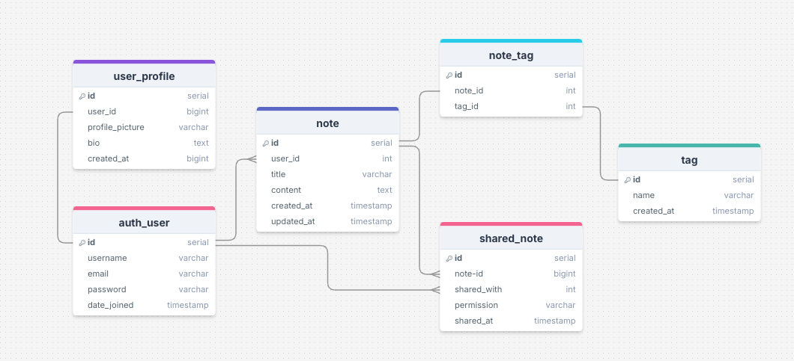
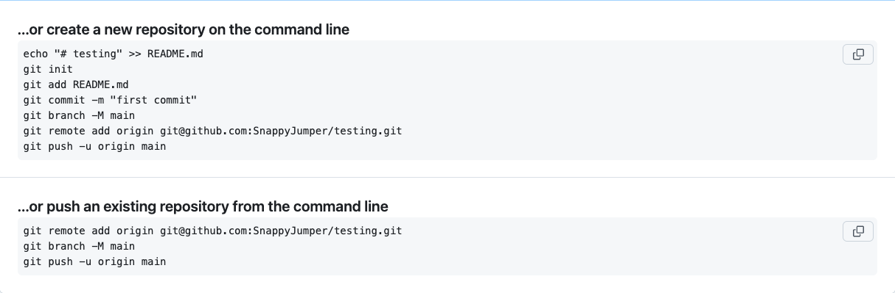
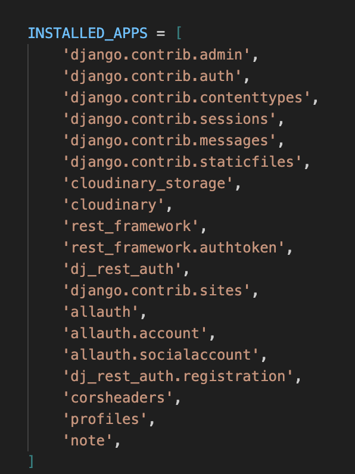
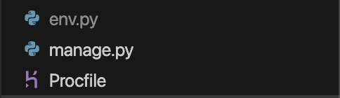
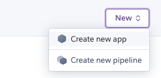

# **_Dually Noted - Django Rest Framework API_**

This repository is the back end REST API which is used by my front-end project, [Dually Noted](https://dually-noted-react-aeaa107c29f9.herokuapp.com/)

The live site can be viewed [here](https://dually-noted-react-aeaa107c29f9.herokuapp.com/)

The live API can be viewed [here](https://dually-noted-f734097d9d34.herokuapp.com/)

The front end README.md can be viewed[here](https://github.com/SnappyJumper/dually-noted/blob/main/README.md)

The back end README.md can be viewed[here](https://github.com/SnappyJumper/dually-noted-drf-api/blob/main/README.md)

# Table of Contents

- [**Objective**](#objective)
- [**Entity Relationship Diagram**](#entity-relationship-diagram)
- [**Database**](#database)
- [**Models**](#models)
- [**Testing**](#testing)
  - [**Manual Testing**](#manual-testing)
  - [**PEP8 Validation**](#pep8-validation)
  - [**Bugs Fixed**](#bugs-fixed)
  - [**Bugs Unresolved**](#bugs-unresolved)
- [**Technologies Used**](#technologies-used)
- [**Deployment To Heroku**](#deployment-to-heroku)
- [**Cloning This Project**](#cloning-and-setting-up-this-project)
- [**Credits**](#credits)
  - [**Content**](#content)
  - [**Media**](#media)
- [**Acknowledgments**](#acknowledgements)

# Objective

The objective of this API is to provide a secure and fast way of providing data to be utilised in my [Dually Noted](https://dually-noted-react-aeaa107c29f9.herokuapp.com/) front end project. By using simple, secure and purpose designed models, the data will be properly represresented for use in the project.

[Back to top](#table-of-contents)

# Entity Relationship Diagram

To create my entity relationship diagram, I used [DrawSQL](https://drawsql.app/) to display my models in an easy to understand display. This diagram shows the relationship between all my different models.



[Back to top](#table-of-contents)

# Database

In this project I used two databases, [SQLite](https://sqlite.org/) and [Code Institute PostgreSQL](https://dbs.ci-dbs.net/)

- SQLite was used for development of the models. It provided a small and efficient space to develop my code.

- Code Institute PostgreSQL was used for my production database.

# Models

The final Models used in the project were as follows:

### Auth Profile

I used Django's built-in User model django.contrib.auth.models.User to create auth users in my project. This is a secure way to
store the users login credentials and comes built into Django so I didn't have to design my own.

### User Profile

This model contains all the information for the users profile page

A user profile is created when a new auth user is created. The model is embelished with additional content as can be seen below

| Database Value               | Field Type    | Field Argument                                                |
| ---------------------------- | ------------- | ------------------------------------------------------------- |
| user                         | OneToOneField | User, on_delete=models.CASCADE                                |
| profile_picture              | ImageField    | upload_to='images/', default='../default_profile_zx2qdz'      |
| name                         | CharField     | max_length=255, blank=True                                    |
| bio                          | TextField     | blank=True                                                    |
| created_at                   | DateTimeField | auto_now_add=True                                             |

### Note Model

This model contains all the information in regards to notes.

| Database Value               | Field Type      | Field Argument                                                |
| ---------------------------- | -------------   | ------------------------------------------------------------- |
| user                         | OneToOneField   | User, on_delete=models.CASCADE                                |
| title                        | CharField       | max_length=100                                                |
| content                      | TextField       | max_length=255, blank=True                                    |
| created_at                   | DateTimeField   | auto_now_add=True                                             |
| updated_at                   | DateTimeField   | auto_now_=True                                                |
| tags                         | ManyToManyField | Tag, blank=True, related_name='notes'                         |

### Tag Model

This model contains all the information in regards to tags, tags are used to help sort and catagorise notes.

| Database Value               | Field Type      | Field Argument                                                |
| ---------------------------- | -------------   | ------------------------------------------------------------- |
| name                         | CharField       | max_length=50, unique=True                                    |
| created_at                   | DateTimeField   | auto_now_add=True                                             |

### SharedNote Model

This model manages the relationship between notes and who they are shared with.

| Database Value               | Field Type      | Field Argument                                                |
| ---------------------------- | -------------   | ------------------------------------------------------------- |
| note                         | ForeignKey      | Note, on_delete=models.CASCADE, related_name='shared_notes'   |
| shared_with                  | ForeignKey      | User, on_delete=models.CASCADE, related_name='shared_with_me' |
| permission                   | CharField       | max_length=10, choices=permission_choices, default='read'     |
| shared_at                    | DateTimeField   | auto_now_add=True                                             |

[Back to top](#table-of-contents)

# Testing

- ## Manual Testing

| Application | Endpoint                         | Expected Result                                                                              | Pass/Fail |
| ----------- | -------------------------------- | -------------------------------------------------------------------------------------------- | --------- |
| Notes       | /notes/                          | Returns a list of all notes owned by the authenticated user                                  | Pass      |
| Notes	      | /notes/	                         | POST request creates a new note with valid title, content, and optional tags                 | Pass      |
| Notes	      | /notes/int:pk/                   | Returns a single note by ID if owned by the requesting user                                  | Pass      |
| Notes       | /notes/int:pk/                   | PUT request updates the note only if user is the owner                                       | Pass      |
| Notes	      | /notes/int:pk/                   | DELETE request deletes the note only if user is the owner                                    | Pass      |
| Tags	      | /tags/                           | Returns a list of all tags ordered by creation date                                          | Pass      |
| Tags        | /tags/	                         | POST request creates a new tag if the name is unique	                                        | Pass      |
| Tags        | /tags/int:pk/                    | Returns a single tag with its name and associated notes	                                    | Pass      |
| Tags	      | /tags/int:pk/                    | PUT request updates tag name if valid and unique	                                            | Pass      |
| Tags	      | /tags/int:pk/                    | DELETE request deletes the tag if it exists	                                                | Pass      |
| SharedNotes |	/shared-notes/                   | Returns a list of notes shared with the authenticated user	                                | Pass      |
| SharedNotes |	/shared-notes/                   | POST request shares a note with another user and permission level	                        | Pass      |
| SharedNotes |	/shared-notes/int:pk/            | GET returns a shared note only if user is the recipient	                                    | Pass      |
| SharedNotes |	/shared-notes/int:pk/            | PUT updates shared note content if user has 'edit' permission	                            | Pass      |
| SharedNotes |	/shared-notes/int:pk/            | DELETE removes the share link for the user (self-removal)	                                | Pass      |
| Profiles    |	/profiles/                       | Returns a list of all user profiles	                                                        | Pass      |
| Profiles    |	/profiles/int:pk/                | GET returns profile data including name, bio, and profile_picture	                        | Pass      |
| Profiles    |	/profiles/int:pk/                | PUT updates profile if the authenticated user is the profile owner	                        | Pass      |
| Profiles    |	/profiles/username/str:username/ | Returns profile data by username (used for shared note ownership linking)	                | Pass      |


- ## PEP8 Validation

Ive been using [Flake8](https://flake8.pycqa.org/en/latest/) for code validation in Python. This enabled me to stay ontop of my code validation throughout the duration of the project.

I did have two issues by the time of deployment but one involves the testing file which was created when the project was first initailaised and I havent used. 


The other issue was a scoping issue as Flake8 couldn't recognise the use of env in this file.


I also used [isort](https://pycqa.github.io/isort/) to organise my imports

- ## Bugs Fixed

During testing I discovered that there was an issue when a user tried to remove themselves from a note another person shared with them, when their permissions were set to Read Only.

To fix this issue I had to fix the permission logic to allow the ```shared_with``` user to delete the shared note relationship.

- ## Bugs Unresolved

As far as I'm aware, after testing there are no major unresolved bugs at time of writing.

[Back to top](#table-of-contents)

# Technologies Used

## Languages

[Python](https://www.python.org/) was used for my back end language.

## Libraries and Frameworks

[Django](https://www.djangoproject.com/) was used as my back end python framework. It enabled me to rapidly develop my back end with a clean and pragmatic design.

[Django Rest Framework](https://www.django-rest-framework.org/) was used to build my back end Web APIs. It is a versitile and strong toolkit.

## Packages
- [asgiref](https://pypi.org/project/asgiref/) Supports Django’s asynchronous features (ASGI interface)
- [certifi](https://pypi.org/project/certifi/) Provides Mozilla’s CA Bundle for HTTPS requests
- [charset-normalizer](https://pypi.org/project/charset-normalizer/) Detects and decodes text encoding in HTTP responses
- [cloudinary](https://pypi.org/project/cloudinary/) Python SDK for managing media uploads and delivery with Cloudinary
- [defusedxml](https://pypi.org/project/defusedxml/) Safely parses XML in Python (protection from vulnerabilities)
- [dj-database-url](https://pypi.org/project/dj-database-url/) Parses database URLs (used for environment-based DB config on Heroku)
- [dj-rest-auth](https://pypi.org/project/dj-rest-auth/) Prebuilt auth endpoints (login, logout, register, password reset, etc.)
- [django-allauth](https://pypi.org/project/django-allauth/) Full-featured authentication system (social logins, email verification)
- [django-cloudinary-storage](https://pypi.org/project/django-cloudinary-storage/) Integrates Cloudinary with Django’s storage backend
- [django-cors-headers](https://pypi.org/project/django-cors-headers/)Enables Cross-Origin Resource Sharing (CORS) for API access from frontend
- [djangorestframework_simplejwt](https://pypi.org/project/djangorestframework-simplejwt/) Adds JWT authentication to Django REST Framework
- [gunicorn](https://pypi.org/project/gunicorn/) WSGI HTTP server for running Django in production (e.g., on Heroku)
- [idna](https://pypi.org/project/idna/) Handles internationalized domain names
- [oauthlib](https://pypi.org/project/oauthlib/) Implements OAuth 1 and 2 for secure user authorization
- [Pillow](https://pypi.org/project/Pillow/) Adds support for image processing and uploads
- [psycopg2](https://pypi.org/project/psycopg2/) PostgreSQL adapter for Django
- [pycparser](https://pypi.org/project/pyparsing/) Required for building C-based packages (used by cffi)
- [PyJWT](https://pypi.org/project/PyJWT/) JSON Web Token implementation for encoding/decoding user tokens
- [pytz](https://pypi.org/project/pytz/) Timezone definitions and conversions (used in Django time handling)
- [requests](https://pypi.org/project/requests/) Simplified HTTP requests (used in auth, API calls, etc.)
- [requests-oauthlib](https://pypi.org/project/requests-oauthlib/) OAuth support for Python requests
- [six](https://pypi.org/project/six/) Python 2 and 3 compatibility utility
- [sqlparse](https://pypi.org/project/sqlparse/) Parses and formats SQL (used by Django for migrations)
- [urllib3](https://pypi.org/project/urllib3/) Powerful HTTP client library for Python
- [whitenoise](https://whitenoise.readthedocs.io/en/stable/django.html) Serves static files directly in production without needing a CDN

## Other Tools

- [VSCode](https://code.visualstudio.com/) Where the code was created and edited.
- [GitHub](https://github.com/) Used as a repository for the code.
- [GitBash](<https://en.wikipedia.org/wiki/Bash_(Unix_shell)>) Used in the terminal to push to GitHub repository.
- [Heroku](https://dashboard.heroku.com) Used to deploy the back end.
- [Cloudinary](https://cloudinary.com/) Used to host the static files.
- [Virutal Environment](https://docs.python.org/3/library/venv.html) Used for creating the virtual enviroment.

[Back to top](#table-of-contents)

# Deployment to Heroku

The back-end was deployed to [Heroku](https://www.heroku.com) and was done as follows

First of all we create a new repository in [GitHub](https://github.com/).

- Go to [GitHub](https://github.com/).
- Create a new repo with no template.

Once the new repo has been created you'll need to pull it down into your local machine. I used [VSCode](https://code.visualstudio.com/) to create my code so I will be describing the VSCode way here.

- Copy either the "create new repo on the command line code" or the "push an existing repo from the command line code". I will use the latter here



Now within VSCode in a new folder for your project we need to open a command prompt to pull the empty repo in/

- Create a new project on VSCode and save it to where you require it on your machine.
- Open a new terminal and paste the code you copied earlier and run it to connect VSCode to GitHub.

Now we need to install Django and some other packages

- In the terminal run ```pip install 'django<4'```
- Create the new project by running ```django-admin startproject <your_app_name_here>``` 
- Next run ```pip install django-cloudinary-storage``` and ```pip install Pillow``` to install cloudinary storage and pillo separately.

Now our new installed apps need to be added to our ```settings.py``` file



The next thing to do is create a new ```env.py``` file at the root level and paste in the following

```Python
import os

os.environ["CLOUDINARY_URL"] = "YOUR_CLOUDINARY_URL_HERE"

```

Where you paste in your actual CLOUDINARY_URL.

Back in ```settings.py``` we have to import your ```env.py``` provided it exists.

```Python
import os

if os.path.exists("env.py"):
    import env
```

Followed by our new CLOUDINARY URL

```Python
CLOUDINARY_STORAGE = {"CLOUDINARY_URL": os.environ.get("CLOUDINARY_URL")}
```

After that you must define the MEDIA_URL and DEFAULT_FILE_STORAGE in ```settings.py```

```Python
MEDIA_URL = "/media/"

DEFAULT_FILE_STORAGE = "cloudinary_storage.storage.MediaCloudinaryStorage"
```

Now feel free to start developing your application remembering to store each new app in the installed app section of ```settings.py```

Once youre ready to deploy your project start bt installing JSON Web Token Authentication

- in the terminal run ```pip install dj-rest-auth```

add rest framework's auth token and django rest auth to installed apps

```Python
INSTALLED_APPS = [
    "rest_framework.authtoken",
    "dj_rest_auth",
]
```

and add the auth urls to your urlpatterns list

```Python
urlpatterns = [
    path("dj-rest-auth/", include("dj_rest_auth.urls")),
]
```

Migrate the database ```python manage.py migrate```

Next run ```pip install 'dj-rest-auth[with_social]'``` and add the following to installed apps

```Python
INSTALLED_APPS = [
    "django.contrib.sites",
    "allauth",
    "allauth.account",
    "allauth.socialaccount",
    "dj_rest_auth.registration",
]
```

Add a SITE_ID variable to ```settings.py```

```Python
SITE_ID = 1
```

And the registration urls to the urlpatterns list

```Python
urlpatterns = [
    path('dj-rest-auth/registration/', include('dj_rest_auth.registration.urls')),
]
```

Then its time to install JWT tokens functionality

- run ```pip install djangorestframework-simplejwt``` in the terminal

Add the following to ```env.py```

```Python
os.environ['DEV'] = '1'
```

In ```settings.py``` set DEBUG to DEV

```Python
DEBUG = 'DEV' in os.environ
```

Next, staying in ```settings.py``` add the following code

```Python
REST_PAGINATION = "rest_framework.pagination.PageNumberPagination"

REST_FRAMEWORK = {
    "DEFAULT_AUTHENTICATION_CLASSES": [
        (
            "rest_framework.authentication.SessionAuthentication"
            if "DEV" in os.environ
            else "dj_rest_auth.jwt_auth.JWTCookieAuthentication"
        )
    ],
    "DEFAULT_PAGINATION_CLASS": REST_PAGINATION,
    "PAGE_SIZE": 100,
    "DATETIME_FORMAT": "%d %b %Y",
}
```

This differenciates between dev and prod mode and sets pagination settings and date and time format.

After that place the following code in ```settings.py``` to enable token auth, cookie declaration and to send tokens via HTTPS

```Python
REST_USE_JWT = True
JWT_AUTH_SECURE = True
JWT_AUTH_COOKIE = "my-app-auth"
JWT_AUTH_REFRESH_COOKIE = "my-refresh-token"
JWT_AUTH_SAMESITE = "None"
```

Now we create a root route to act as a welcome screen for visitors to our api

- In your main project folder create a new ```views.py``` file and in it add the following

```Python
from rest_framework.decorators import api_view
from rest_framework.response import Response


@api_view()
def root_route(request):
    """
    Welcome message
    upon loading the API
    """
    return Response({"message": "Welcome!"})
```

Add that new route to the urlpatterns list in the main ```urls.py``` file

```Python
from .views import root_route

    path("", root_route),
```

Now we head over to [Code Institute PostgreSQL](https://dbs.ci-dbs.net/) and enter our details to be emailed a URL to our new database. Copy the URL

Back in our local project, open the ```env.py``` file and paste the following

```Python
os.environ.setdefault(
    "DATABASE_URL", "<YOUR_DB_URL_HERE>",
)
```

Now run ```pip install dj_database_url``` in your terminal and once thats done import it to ```settings.py```

```Python
import dj_database_url
```

After that we separate our dev and prod databases like so

```Python
if "DEV" in os.environ:
    DATABASES = {
        "default": {
            "ENGINE": "django.db.backends.sqlite3",
            "NAME": BASE_DIR / "db.sqlite3",
        }
    }
else:
    DATABASES = {"default": dj_database_url.parse(
        os.environ.get("DATABASE_URL"))}
    print("Connected to live database")
```

Once that's been added install gunicorn

- in the terminal type ```pip install gunicorn```

Then create a new ```Procfile``` at the root level of the project



Inside the ```Procfile``` add the following to show Heroku how to run your project

```Python
release: python manage.py makemigrations && python manage.py migrate
web: gunicorn <YOUR_APP_NAME>.wsgi
```

Then in ```settings.py``` add 

```Python
ALLOWED_HOSTS = [
    os.environ.get("ALLOWED_HOST"),
    "127.0.0.1",
]
```

This assigns the hosts allowed for your project

Now to install Cors Headers

- Run ```pip install django-cors-headers``` in the terminal
- Then add to installed apps

```Python
INSTALLED_APPS = [
    'corsheaders',
]
```

- Then add it to the TOP of ```MIDDLEWARE``` also (Must be at the top!!)

```Python
MIDDLEWARE = [
    "corsheaders.middleware.CorsMiddleware",
]
```

Now, still in ```settings.py``` we need to set the ```ALLOWED_ORIGINS```

```Python
if "CLIENT_ORIGIN" in os.environ:
    CORS_ALLOWED_ORIGINS = [
        os.environ.get("CLIENT_ORIGIN"),
    ]
if "CLIENT_ORIGIN_DEV" in os.environ:
    CORS_ALLOWED_ORIGINS.append(os.environ.get("CLIENT_ORIGIN_DEV"))

CORS_ALLOW_CREDENTIALS = True

JWT_AUTH_SAMESITE = 'None'
```

Then replace the ```SECRET_KEY``` vaue with a custom one

- In ```env.py``` add and fill in your new secret key value

```Python
os.environ.setdefault("SECRET_KEY", "<YOUR SECRET KEY HERE>")
```

Then, back in ```settings.py``` change the secret key to point to the value you set in ```env.py```

```Python
SECRET_KEY = os.getenv("SECRET_KEY")
```

Update all the requirements to a ```requirements.txt``` file

- run pip freeze > requirements.txt in the terminal

Now Add, Commit and Push your changes

Now you have to set everything up Heroku side.

- Go to [Heroku](https://www.heroku.com)
- Go to your dashboard and click New and Create new app



- Fill in the relevant info and chose the nationality that corresponds to you or as close as.
- Then click create app

Now that you have created your app you need to create ```Config_Vars```

- Navigate to the apps settings and click Reveal Config Vars

- Fill in the following

    - ALLOWED_HOST - This is the URL of your deployed project (without the https)
    - CLIENT_ORIGIN - This is the URL of your deployed front-end project
    - CLIENT_ORIGIN_DEV - This is the URL when developing locally
    - CLOUDINARY_URL - This is your Cloudinary API key
    - DATABASE_URL - This is your production database URL
    - DISABLE_COLLECTSTATIC - This will be removed before submission
    - SECRET_KEY - This is the secret key you have created

Now to link our heroku app to our GitHub repo

- Navigate to the Deplou Tab in your Heroku app
- Choose GitHub
- Find your repo
- Click connect

Once that's done you're finally able to deploy, Click on deploy branch to Deploy your project

Wait for Build and then a button should appear to take you to your site.

[Back to top](#table-of-contents)

# Credits

### Content

This project was inspired by the Moments project and DRF API walkthrough from [Code Institute](https://codeinstitute.net/)
The models were altered and modified to suit Dually Noted.

I used the [Django REST Framework Documentation](https://www.django-rest-framework.org/api-guide/permissions/) to help put this together as well as [Stack Overflow](https://stackoverflow.com/questions) and [ChatGPT](https://openai.com/index/chatgpt/) for help with Debugging and answering questions.

# Acknowledgements

I enjoyed the process of making this project and found it a real step-up from Project 4. I hope to be able to encorporate all I've learned here into a bright future career.

I would like to thank

- Marcel for all his guidance and help this past year.
- My partner for her love, care and for putting up with my mood swings!
- My parents for their love and guidance.
- To Code Institute and it's fantastic Slack community for helping me achieve my goals and change career.

Thank You All!

[Back to top](#table-of-contents)