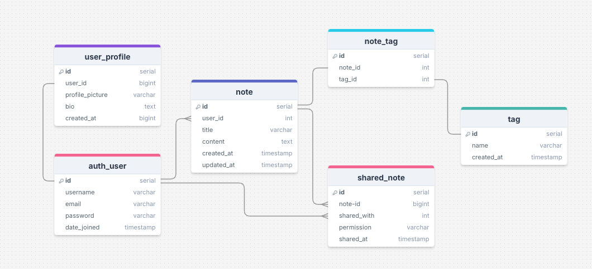

# **_Dually Noted - Django Rest Framework API_**

This repository is the back end REST API which is used by my front-end project, [Dually Noted](https://dually-noted-react-aeaa107c29f9.herokuapp.com/)

The live site can be viewed [here](https://dually-noted-react-aeaa107c29f9.herokuapp.com/)

The live API can be viewed [here](https://dually-noted-f734097d9d34.herokuapp.com/)

The front end README.md can be viewed[here](https://github.com/SnappyJumper/dually-noted/blob/main/README.md)

The back end README.md can be viewed[here](https://github.com/SnappyJumper/dually-noted-drf-api/blob/main/README.md)

# Table of Contents

- [**Objective**](#objective)
- [**Entity Relationship Diagram**](#entity-relationship-diagram)
- [**Database**](#database)
- [**Models**](#models)
- [**Testing**](#testing)
  - [**Manual Testing**](#manual-testing)
  - [**PEP8 Validation**](#pep8-validation)
  - [**Bugs Fixed**](#bugs-fixed)
  - [**Bugs Unresolved**](#bugs-unresolved)
- [**Technologies Used**](#technologies-used)
- [**Deployment To Heroku**](#deployment-to-heroku)
- [**Cloning This Project**](#cloning-and-setting-up-this-project)
- [**Credits**](#credits)
  - [**Content**](#content)
  - [**Media**](#media)
- [**Acknowledgments**](#acknowledgements)

# Objective

The objective of this API is to provide a secure and fast way of providing data to be utilised in my [Dually Noted](https://dually-noted-react-aeaa107c29f9.herokuapp.com/) front end project. By using simple, secure and purpose designed models, the data will be properly represresented for use in the project.

[Back to top](#table-of-contents)

# Entity Relationship Diagram

To create my entity relationship diagram, I used [DrawSQL](https://drawsql.app/) to display my models in an easy to understand display. This diagram shows the relationship between all my different models.

[Back to top](#table-of-contents)

# Database

In this project I used two databases, [SQLite](https://sqlite.org/) and [Code Institute PostgreSQL](https://dbs.ci-dbs.net/)

- SQLite was used for development of the models. It provided a small and efficient space to develop my code.

- Code Institute PostgreSQL was used for my production database.

# Models

The final Models used in the project were as follows:

### Auth Profile

I used Django's built-in User model django.contrib.auth.models.User to create auth users in my project. This is a secure way to
store the users login credentials and comes built into Django so I didn't have to design my own.

### User Profile

This model contains all the information for the users profile page

A user profile is created when a new auth user is created. The model is embelished with additional content as can be seen below

| Database Value               | Field Type    | Field Argument                                                |
| ---------------------------- | ------------- | ------------------------------------------------------------- |
| user                         | OneToOneField | User, on_delete=models.CASCADE                                |
| profile_picture              | ImageField    | upload_to='images/', default='../default_profile_zx2qdz'      |
| name                         | CharField     | max_length=255, blank=True                                    |
| bio                          | TextField     | blank=True                                                    |
| created_at                   | DateTimeField | auto_now_add=True                                             |

### Note Model

This model contains all the information in regards to notes.

| Database Value               | Field Type      | Field Argument                                                |
| ---------------------------- | -------------   | ------------------------------------------------------------- |
| user                         | OneToOneField   | User, on_delete=models.CASCADE                                |
| title                        | CharField       | max_length=100                                                |
| content                      | TextField       | max_length=255, blank=True                                    |
| created_at                   | DateTimeField   | auto_now_add=True                                             |
| updated_at                   | DateTimeField   | auto_now_=True                                                |
| tags                         | ManyToManyField | Tag, blank=True, related_name='notes'                         |

### Tag Model

This model contains all the information in regards to tags, tags are used to help sort and catagorise notes.

| Database Value               | Field Type      | Field Argument                                                |
| ---------------------------- | -------------   | ------------------------------------------------------------- |
| name                         | CharField       | max_length=50, unique=True                                    |
| created_at                   | DateTimeField   | auto_now_add=True                                             |

### SharedNote Model

This model manages the relationship between notes and who they are shared with.

| Database Value               | Field Type      | Field Argument                                                |
| ---------------------------- | -------------   | ------------------------------------------------------------- |
| note                         | ForeignKey      | Note, on_delete=models.CASCADE, related_name='shared_notes'   |
| shared_with                  | ForeignKey      | User, on_delete=models.CASCADE, related_name='shared_with_me' |
| permission                   | CharField       | max_length=10, choices=permission_choices, default='read'     |
| shared_at                    | DateTimeField   | auto_now_add=True                                             |

[Back to top](#table-of-contents)

# Testing

- ## Manual Testing

| Application | Endpoint                         | Expected Result                                                                              | Pass/Fail |
| ----------- | -------------------------------- | -------------------------------------------------------------------------------------------- | --------- |
| Notes       | /notes/                          | Returns a list of all notes owned by the authenticated user                                  | Pass      |
| Notes	      | /notes/	                         | POST request creates a new note with valid title, content, and optional tags                 | Pass      |
| Notes	      | /notes/int:pk/                   | Returns a single note by ID if owned by the requesting user                                  | Pass      |
| Notes       | /notes/int:pk/                   | PUT request updates the note only if user is the owner                                       | Pass      |
| Notes	      | /notes/int:pk/                   | DELETE request deletes the note only if user is the owner                                    | Pass      |
| Tags	      | /tags/                           | Returns a list of all tags ordered by creation date                                          | Pass      |
| Tags        | /tags/	                         | POST request creates a new tag if the name is unique	                                        | Pass      |
| Tags        | /tags/int:pk/                    | Returns a single tag with its name and associated notes	                                    | Pass      |
| Tags	      | /tags/int:pk/                    | PUT request updates tag name if valid and unique	                                            | Pass      |
| Tags	      | /tags/int:pk/                    | DELETE request deletes the tag if it exists	                                                | Pass      |
| SharedNotes |	/shared-notes/                   | Returns a list of notes shared with the authenticated user	                                | Pass      |
| SharedNotes |	/shared-notes/                   | POST request shares a note with another user and permission level	                        | Pass      |
| SharedNotes |	/shared-notes/int:pk/            | GET returns a shared note only if user is the recipient	                                    | Pass      |
| SharedNotes |	/shared-notes/int:pk/            | PUT updates shared note content if user has 'edit' permission	                            | Pass      |
| SharedNotes |	/shared-notes/int:pk/            | DELETE removes the share link for the user (self-removal)	                                | Pass      |
| Profiles    |	/profiles/                       | Returns a list of all user profiles	                                                        | Pass      |
| Profiles    |	/profiles/int:pk/                | GET returns profile data including name, bio, and profile_picture	                        | Pass      |
| Profiles    |	/profiles/int:pk/                | PUT updates profile if the authenticated user is the profile owner	                        | Pass      |
| Profiles    |	/profiles/username/str:username/ | Returns profile data by username (used for shared note ownership linking)	                | Pass      |

- ## PEP8 Validation

Ive been using [Flake8]